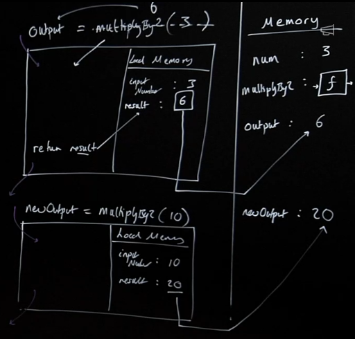
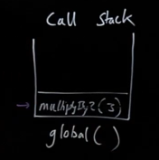

# JavaScript Principles

## Thread of Execution
When JavaScript code runs it:
- Goes through the code line-by-line and executes each line. This is known as the **thread of execution**.
- Saves 'data' - like strings and arrays so we can use that data later - in memory
  - We can even save code(functions)

## Functions
Functions are code we save/define and can use(call/invoke/execute/run) later.

### Execution context
Execution contexts are created to run the code of a function and has two parts:
- Thread of execution
- Memory, this memory is localized to this function
```javascript
const num = 3;
function multiplyBy2(inputNumber) {
  const result = inputNumber * 2;
  return result;
}

const output = multiplyBy2(num);
const newOutput = multiplyBy2(10);
```


## Call Stack
- JavaScript keeps track of what function is currently running(where the thread of execution is) using the call stack.
- When we run a function, we add it to the call stack. Once a function is finished running, it is removed from the call stack.
- Whatever is at the top of the call stack indicates the function that is currently running.


