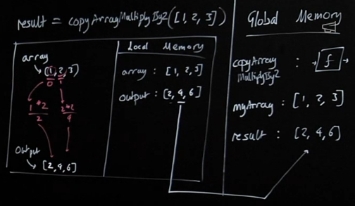

# Functions & Callbacks

## Generalized Functions
- The core premise of functions is to write code once and reuse it again and again with different data. 
- Parameters are placeholders, meaning we don't need to decide what data to run our functionality on until we run the function.
- Higher order functions follow the same principle.
  - We may not want to decide exactly what some of our functionality is until we run our function.

## Repeating Functionality
Let's look at another function and represent it visually:
```javascript
function copyArrayAndMultiplyBy2(array) {
  const output = [];
  for (let i = 0; i < array.length; i++) {
    output.push(array[i] * 2);
  }
  return output;
}

const myArray = [1, 2, 3];
const result = copyArrayAndMultiplyBy2(myArray);
```


## Higher Order Functions
